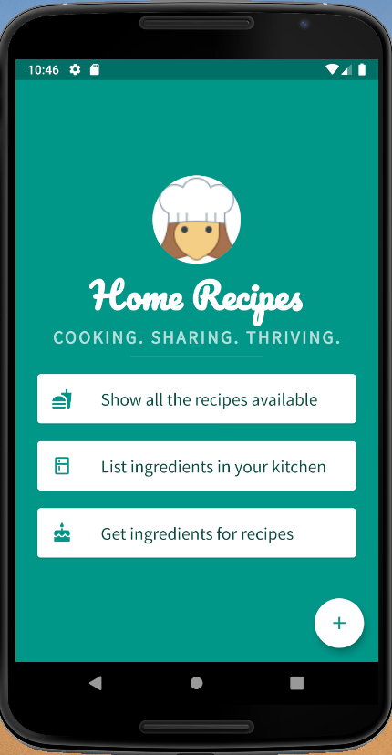

# Home Recipes

A simple full-stack app that uses a power-packed tech stack. Technologies used so far include:
* gRPC
* Golang
* Protobufs 
* Node.js
* Flutter
* Dart
* Material design

## Design
The architecture, API, UI design details are available on this miro board: https://miro.com/app/board/o9J_ktw-EKc=/

## Screenshot
This is how the app looks like as of now. This is available as an Android as well as an iOS app.

