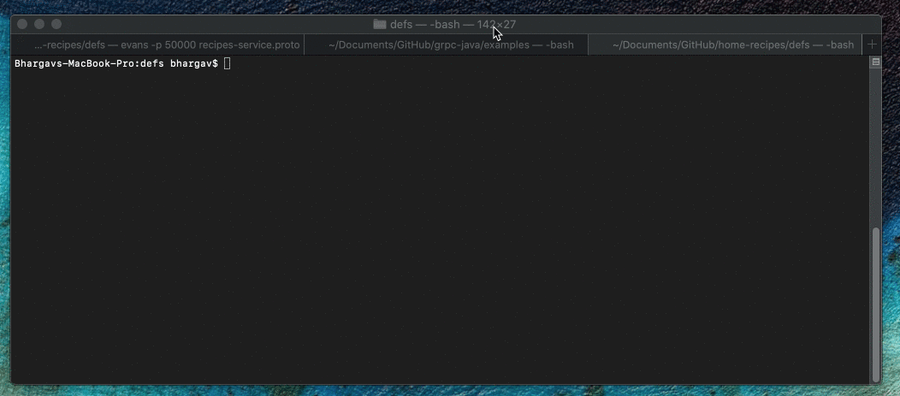
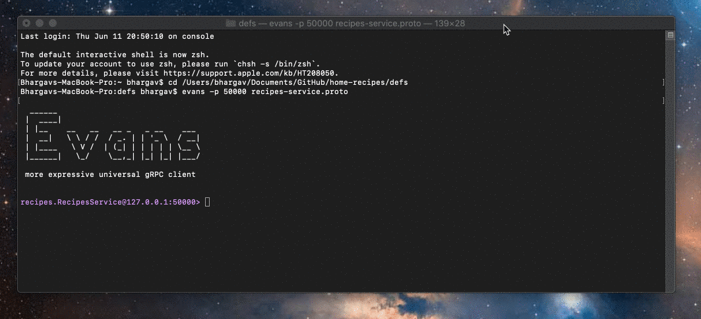
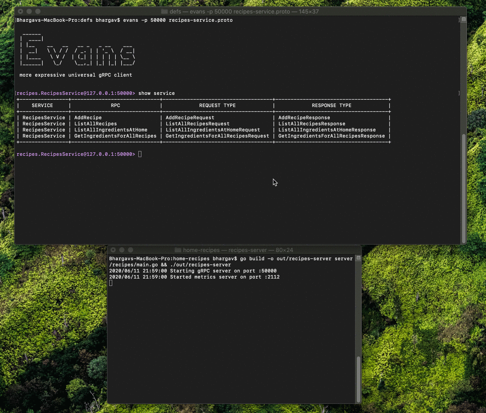

# Home-Recipes Server 

The server uses these ports:
* `50000` for gRPC
* `2112` for HTTP (including telemetry)

### Steps followed to create server:

1. Ensure golang is installed, GOPATH is set

2. Install grpc
    ```
    go get google.golang.org/grpc
    ```

3. Install protoc and confirm version
    * Available here: https://github.com/protocolbuffers/protobuf/releases
    * Once downloaded and added in PATH, check
        ```
        protoc --version
        ```

4. Install "protoc-gen-go" & "promhttp" and add to PATH
    ```
    go get github.com/golang/protobuf/protoc-gen-go
    go get github.com/prometheus/client_golang/prometheus/promhttp
    PATH="$PATH:$(go env GOPATH)/bin"
    ```

5. (optional) Add gRPC reflection to the service if you want to test the services using the Evans CLI (mentioned below)

    Add following import to the main.go server file
    ```
    "google.golang.org/grpc/reflection"
    ```

6. (optional) Install protobuf support for VS code
    * Available here: https://marketplace.visualstudio.com/items?itemName=zxh404.vscode-proto3

7. Create your proto file

8. Run the protoc command to create the generated code
    ```
    protoc ./defs/recipes-service.proto --go_out=plugins=grpc:./server
    ```

9. Implement your server

10. Run your server
    ```
    go build -o out/recipes-server server/recipes/main.go && ./out/recipes-server
    ```

### Steps to test the services using Evans CLI/REPL

1. Install [Evans](https://github.com/ktr0731/evans) REPL 

2. After successful installation, navigate to the folder where the proto files are located and run 
    ```
    evans -p 50000 recipes-service.proto
    ```

The gRPC services can be tested using Evans CLI/REPL as follows:







### Steps to Dockerise the server

1. First, ensure that your server is running locally following the steps above

2. Create a docker build
    ```
    cd home-recipes
    docker build -t kaushikchaubal/home-recipes:<NewTagname> server/
    ```

3. Check if you can see the image
    ```
    docker images kaushikchaubal/home-recipes
    ```

4. Run the new image locally
    ```
    docker run -it -p 50000:50000 -p 2112:2112 kaushikchaubal/home-recipes:<NewTagname>
    ```

5. (One per session) Login to docker
    ```
    docker login
    ```

6. Docker push the latest tag
    ```
    docker push kaushikchaubal/home-recipes:<NewTagname>
    ```